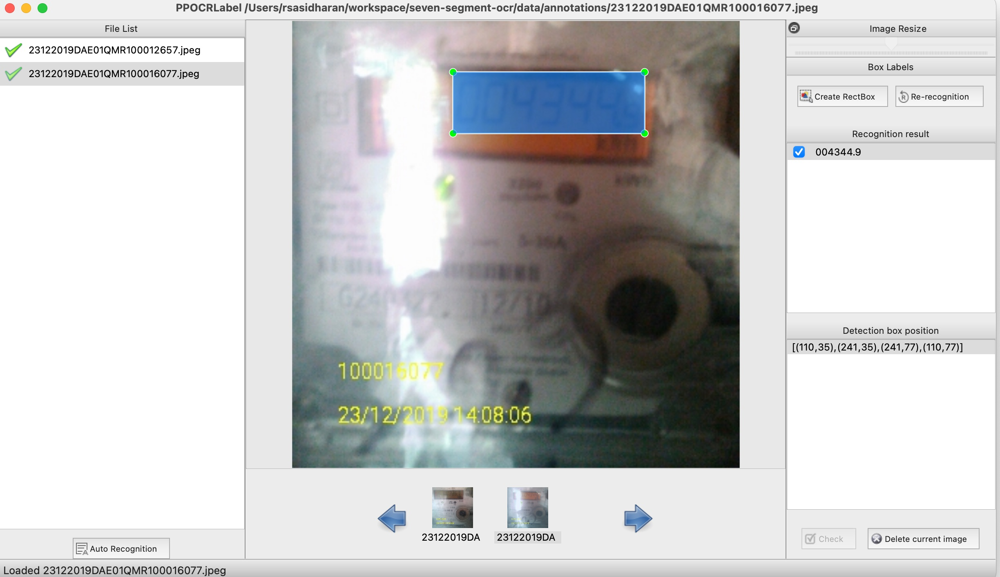
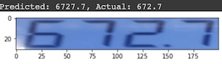
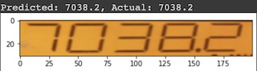
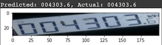
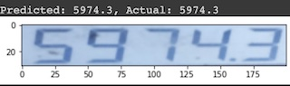
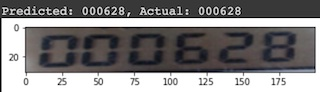
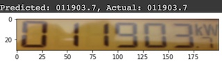
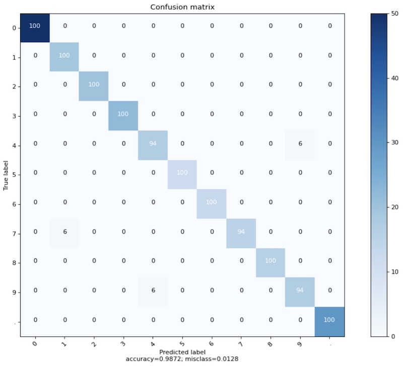

## Text recognition for seven segment display using [keras-ocr](https://github.com/faustomorales/keras-ocr).

OCR for seven segment display using tensorflow lite. 
The trained keras model is converted to tensorflow lite model `model_float16.tflite`

#### Setup
  1. Clone the repo locally  
      ```
      git clone https://github.com/renjithsasidharan/seven-segment-ocr
      ```
  2. Install dependencies
     ```
     pip install requirements.txt
     ```

#### Training Data
Training data is present in `data/ocr_training_data`
```console
data/ocr_training_data
├── 00498afd-2925-45ef-bfb3-8c55204ace42.png
├── 011fd0b2-837c-424c-a71b-a2a92305a532.png
├── 04976571-ac6b-425f-9474-3b95a4fb9613.png
├── 068e4ff1-acf0-43e7-b052-7a59a9c3f87b.png
```
Ground truth file is `data/ocr_training_data/gt.txt`

#### Create more training data
You can create more training data by first creating annotations and then creating training data from annotations
##### Create annotations
  1. Add images to `data/annotations` folder.
  2. Install annotation tool `PPOCRLabel` from https://github.com/PaddlePaddle/PaddleOCR/tree/release/2.4/PPOCRLabel
  3. Open `PPOCRLabel` and start annotating new images.
     1. Create `RectBox` around the reading
     2. Add the reading in `Recognition Result`
     3. Save annotations
   
##### Create Training data from annotations
From `seven-segment-ocr` directory run the command
```
python create_ocr_training_data_from_annotations.py
```
This will **append** the training data to `data/ocr_training_data`

#### How to train the model using google Colab
Train the model using jupyter notebook `keras_ocr_7_seg.ipynb`
  1. Upload the notebook `keras_ocr_7_seg.ipynb` to google Colab
  2. Create archive of folder `data/ocr_training_data`.
  3. Upload `ocr_training_data.zip` to google Colab
  4. Run the training
  5. Once the training is over, your trained model `meeter_rec_float16.tflite` will be automatically downloaded to your machine from Colab
#### Evaluation
To run prediction on an image using tensorflow lite
```console
python predict.py --image test/1.png --model model_float16.tflite
```

To run predictions on all images in directory
```console
python eval_tflite.py --eval_dir /data/ocr_training_data
```

Here are some results of ocr extraction:

  
  

Confusion matrix


